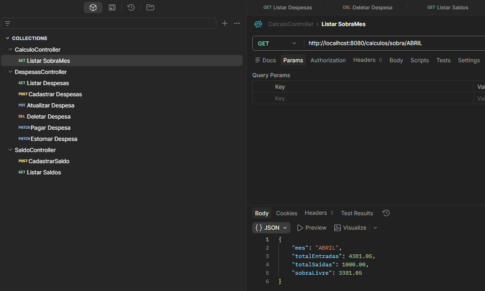

# 🏦 FinancialFamily - Gestão Financeira Inteligente

**FinancialFamily** é uma API REST robusta desenvolvida para o controle financeiro familiar, focada na clareza de gastos, gestão de caixa e planejamento para investimentos futuros.

Este projeto representa o **MVP (Produto Mínimo Viável)** de uma plataforma completa de gestão de patrimônio, permitindo que casais ou indivíduos organizem suas contas de forma estratégica, separando o que é "dívida" do que é "gasto realizado".

---

## 🚀 O que este MVP entrega?

Atualmente, a API já processa o fluxo completo de movimentação financeira mensal:

- **Gestão de Despesas:** CRUD completo com controle de status (Paga/Pendente).
- **Gestão de Saldos (Rendas):** Cadastro de múltiplas fontes de receita (Salários, Extras, Prêmios).
- **Motor de Cálculo Especializado:** Um serviço orquestrador que calcula a **Sobra Livre** real do mês (Total de Entradas - Total de Despesas Efetivamente Pagas).
- **Arquitetura Profissional:** Separação clara de responsabilidades entre Controllers, Services, DTOs e Repositories.

---

## 🛠️ Stack Tecnológica

O projeto utiliza o que há de mais moderno no ecossistema Java em 2026:

- **Linguagem:** Java 25 (Latest Features)
- **Framework:** Spring Boot 4.0.3 (Vanguard Version)
- **Banco de Dados:** PostgreSQL
- **Migrações:** Flyway (Versionamento evolutivo de Schema)
- **Persistência:** Spring Data JPA / Hibernate
- **Segurança:** Proteção de credenciais via variáveis de ambiente (`.env`) e uso de DTOs (Records) para ocultar entidades do banco.

---

## 🏗️ Arquitetura e Clean Code

A aplicação foi desenhada seguindo os princípios de **Clean Code** e **SOLID**:

1. **Domain:** Entidades puras e Enums (como o `Mes.java`) que garantem integridade dos dados.
2. **DTOs (Records):** Uso de Java Records para imutabilidade e segurança no tráfego de dados.
3. **Services Orquestradores:** O `CalculosService` não acessa o banco diretamente; ele orquestra as informações vindas do `DespesaService` e `SaldoService`.
4. **Database Migrations:** Uso de Flyway para garantir que o banco de dados seja recriado perfeitamente em qualquer ambiente.


---

## 📈 Roadmap (Próximos Passos)

- [ ] **Paginação:** Implementação de Spring Pageable nas listagens de grande volume.
- [ ] **Soft Delete:** Sistema de exclusão lógica para manutenção de histórico.
- [ ] **Módulo de Investimentos:** Gestão de Carteira (Ações, FIIs e Renda Fixa).
- [ ] **Autenticação:** Segurança com Spring Security e JWT.

---

## 💻 Como Rodar o Projeto

1. Clone o repositório.
2. Certifique-se de ter o PostgreSQL instalado e rodando.
3. Crie um arquivo `.env` na raiz do projeto com as chaves:
    - `DB_NAME=seu_banco`
    - `DB_USERNAME=seu_usuario`
    - `DB_PASSWORD=sua_senha`
4. Execute o comando Maven:
   ```bash
   mvn spring-boot:run
---
### 📊 Demonstração da API (Exemplo de Resposta)

---
## 👤 Autor

Desenvolvido com foco em excelência técnica por **Marcos Paulo de Freitas Pereira**.

Estudante de Engenharia de Software e Desenvolvedor Backend apaixonado pelo ecossistema Java. Este projeto nasceu da necessidade real de organizar as finanças familiares de forma precisa e estratégica. O objetivo foi transformar um **problema interno** de gestão de caixa em uma **solução escalável**, utilizando as tecnologias mais modernas do ecossistema Java para garantir que cada centavo da "Sobra Livre" seja direcionado para o futuro da família.

---

### 🤝 Contato e Conexões

- **LinkedIn:** [linkedin.com/in/marcos-paulo7](https://www.linkedin.com/in/marcos-paulo7)
- **Instagram:** [@__.kiin](https://www.instagram.com/__.kiin)
- **Portfólio GitHub:** [github.com/Marcos-Dev7](https://github.com/Marcos-Dev7)

---